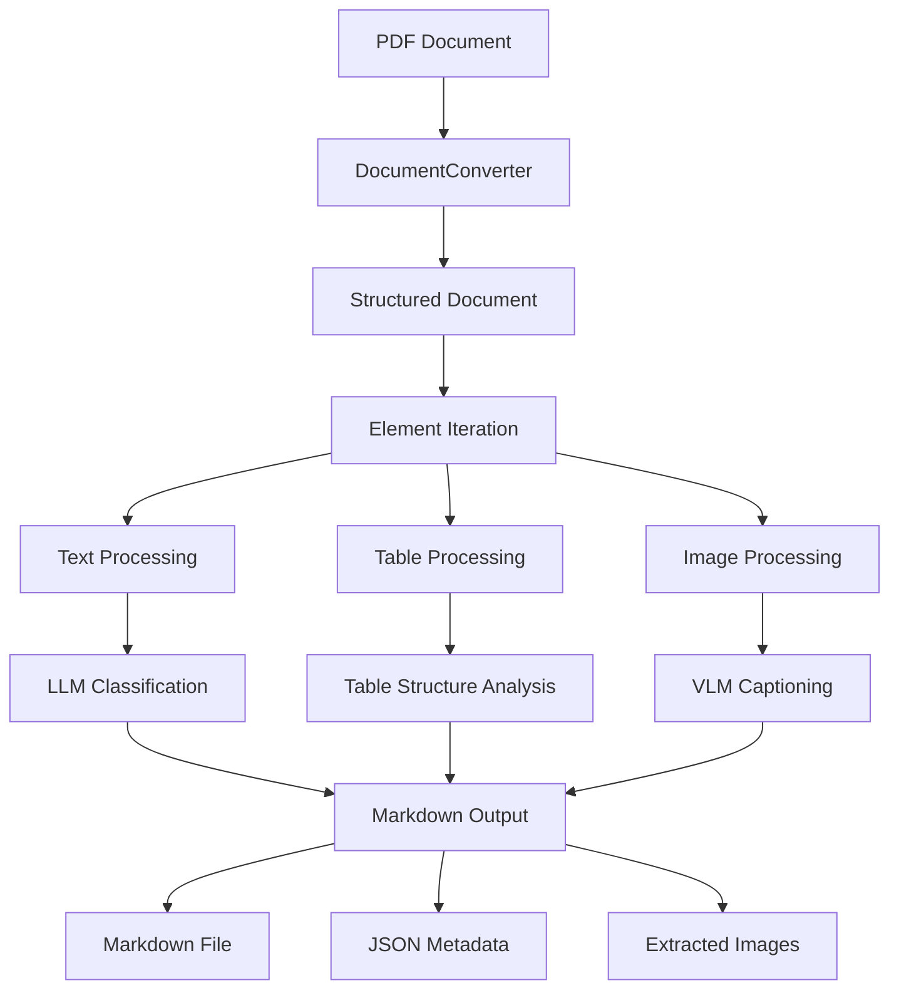

# Docling2md

A lightweight tool to convert PDF documents into structured Markdown and JSON. It supports table repair, image captioning, heading recognition, and structured data extraction.

---

## Project Overview

**Docling2md** is a document understanding and conversion tool built on the [Docling](https://github.com/docling-project/docling.git) framework and integrated with vision-language models (VLMs) and large language models (LLMs). Key features include:

- Converting PDFs into structured Markdown
- Automatically extracting headings and paragraph structure
- Using a VLM to generate image captions
- Repairing tables when table image recognition fails (table slicing + VLM reconstruction)
- Emitting structured JSON for downstream tasks such as knowledge graphs and search indexes

---

## Installation and Environment

### 1. Clone the repository
```bash
git clone https://github.com/your-username/Docling2md.git
cd Docling2md
```

### 2. Install dependencies

#### 2.1 Install Python dependencies:
```bash
pip install -r requirements.txt
```
#### 2.2 Configure **poppler**
Extract the `poppler` archive to the project root or install it system-wide.

### 3. Configuration (`config.yaml`)
```yaml
OPENAI:
  api_key: "<your-deepseek-api-key>"
  base_url: "https://api.deepseek.com"
  model: "deepseek-chat"  # default chat model for DeepSeek
  max_concurrency: 10  # maximum concurrent requests for the chat model

VLM:
  api_key: "<your-dashscope-api-key>"
  base_url: "https://dashscope.aliyuncs.com/compatible-mode/v1"
  model: "qwen2.5-vl-72b-instruct"  # default VLM model
  max_concurrency: 3  # maximum concurrent VLM requests

OCR:
  enabled: true

POPPLER:
  path: "D:/your_path_to/poppler/Library/bin"  # path to extracted poppler binaries
```

---

## Usage

### 1. Modify the input PDF path
```bash
input_pdf_path = Path("D:/Docling2md/your_path_to/.pdf")
```

### 2. Run the main script
```bash
python pdf2md.py
```
Or embed `convert_pdf_to_markdown_with_images()` into your own pipeline.

### 3. Outputs
- Markdown file: `output/<pdf_hash>/<hash>.md`
- JSON file: `output/<pdf_hash>/<hash>.json`
- Page images: `output/<pdf_hash>/page/page-*.png`
- Table and image files: `output/<pdf_hash>/*.png`

---

### 4. Workflow diagram


## Highlights

- **PDF layout parsing**: Uses Docling to extract tables, images, and text elements
- **Table image repair**: Supports automatic slicing + VLM reconstruction for problematic tables
- **Image captioning**: VLM generates short captions and embeds them in Markdown
- **Text classification**: Uses DeepSeek to decide whether text is a heading or paragraph
- **Structured output**: Produces unified JSON that includes fields like `type`, `level`, `page_number`, and `bbox`

---

## Project structure
```
.
├── pdf2md.py
├── config.yaml
├── prompt/
│   ├── VLM_prompt.py  # used for image caption prompts
│   ├── text_type_prompt.py  # used to decide heading vs paragraph
│   ├── text_repair_prompt.py  # used to repair text without spaces
│   └── table_repair_prompt.py  # used to repair problematic table images
├── output/
│   └── <pdf_hash>/
│       ├── page/
│       ├── *.png
│       ├── *.md
│       └── *.json
└── ...
```

---

## Example: table repair using vision models


```
| tD(on)  | - | 20 | - | ns | V_DS=400V, V_GS=0 - 12V, I_D=3A, R_G=30Ω |
| ------- | - | -- | - | -- | ---------------------------------------- |
| tR      | - | 7  | - | ns | V_DS=400V, V_GS=0 - 12V, I_D=3A, R_G=30Ω |
| tD(off) | - | 80 | - | ns | V_DS=400V, V_GS=0 - 12V, I_D=3A, R_G=30Ω |
| tF      | - | 6  | - | ns | V_DS=400V, V_GS=0 - 12V, I_D=3A, R_G=30Ω |
```

---

## Contact
If you have suggestions or issues, please open an issue or submit a PR.

---

## License
This project is licensed under the MIT License.

---

> This project integrates Qwen-VL and DeepSeek models and is intended for academic research and technical validation only.

